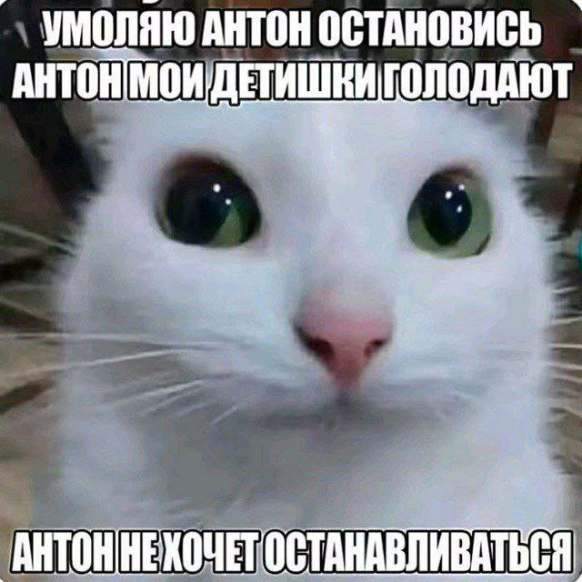

# Материалы для ВСОШ по ИИ 2026 г.

## Листочки матеша

[Оценка + пример](math/Оценка+Пример.pdf)  

[Матан - производные и оптимизация](math/производные_оптимазиция.pdf)  
[Матан - градиентный спуск](math/GD.pdf)  
[Матан - производные и градиенты - задачи](math/Производные%20и%20Градиенты%20задачи.pdf)  

[Случайные графы](math/rand_graph.pdf)  
[Тервер - задачи](math/probability_problems.pdf)  
[Тервер - шпора](math/probability_shpora.pdf)  

[Линал - СЛАУ](math/linalg.pdf)  
[Линал - СЛАУ - задачи](math/сборная_ии_цпм_задачи_слу.pdf)
[Линал - матрицы и векторы - задачи](math/цпм_ии_математика_9pt.pdf),  [разбор](math/цпм_ии_векторы_и_матрицы_разбор.pdf)  
[Линал - задачи](math/интенсив_линал_1_ученик.pdf)  

[Графы 1](math/graphs_medium.pdf)  
[Графы 2](math/graphs_hard.pdf)  
[Размерность Вапника-Червоненкиса - задачи](math/Вапник-Червоненкис.pdf)  
[Неравенства - задачи](math/сборная_ии_неравенства_задачи.pdf)  

## МЛ тетрадки

[Pytorch](notebooks/seminar_pytorch_student.ipynb)  
[CV (туториал)](notebooks/seminar_convnets_student.ipynb)  
[CV (потренироваться)](https://colab.research.google.com/drive/1mLabVzIrunqEzWvaeQuByKMh9gj5dJaq?usp=sharing)  
[Кластеризация и PCA](notebooks/ml_knn_clustering_pca_lecture.ipynb)  
[NLP](notebooks/NLP_classic_tasks_tasks_only.ipynb), [NLP с ответами](notebooks/NLP_classic_tasks_notebook.ipynb), [данные к тетрадке](data/nlp)  

## Лекции Андрея (дл)

[ДЛ, CV](ml/General.pdf), [тетрадки к лекции](data/cv), [ссылки](data/cv/links.md)  

## Кагли

Многие кагли приватные, ниже постарался указать исходную ссылку для них. Кагли авторские от сборной 

### Численные данные

[Морские ушки](https://www.kaggle.com/t/a66d8b1ad4f64a8d8aa1411097e2ff2e)  
[Диабет](https://www.kaggle.com/t/fe2920f09058486b8a2716dec9c7ed40)  
[Цироз](https://www.kaggle.com/competitions/sbornaya-po-ii-cirrhosis)  
[Цены на недвижимость](https://www.kaggle.com/competitions/sbornaya-po-ii-californiya/)  
[Рейтинг мобильного приложения](https://www.kaggle.com/t/87de35f43c2841dd98cf3e7423c28a3a)  

### Cat

[Дефолт](https://www.kaggle.com/t/435e27c7c5844b7bb3bb1b9ae107851e)  
[Время поездки такси](https://www.kaggle.com/t/8c57f665ba704c76b60149c7ee972a60)  
[Отток клиентов](https://www.kaggle.com/t/b645bd1294a643c486f88a08a114811a)  
[Время доставки](https://www.kaggle.com/t/9b49e3491fb14a1394e909bf97c56c3e)  

### CV

[Эмоциональный интеллект](https://www.kaggle.com/t/101782325275429b8c3c9eba5345060b)  
[Греческие буквы](https://www.kaggle.com/t/e39edd43a6fe49178651fd6cc193f1de)  
[Положение точек на котах](https://www.kaggle.com/t/e96012d07a67422c8b017e5a3b6a6d79)  
[Эмоции котов](https://www.kaggle.com/t/bf8203dcbb484cd282c421ef7d20970d), [решения](notebooks/pets)  
[Буткемп](https://www.kaggle.com/t/e08c202f929841b0848fc84bc1f5519e)  
[Найди зверя](https://www.kaggle.com/competitions/find-zoo)  
[3rd-party - Пневмония](https://www.kaggle.com/datasets/yusufmurtaza01/chest-xray-pneumonia-balanced-dataset)  

### NLP

[Зарплата](https://www.kaggle.com/competitions/salary-prediction-sbornaya-moskvi)  
[Успех стим игр](https://www.kaggle.com/t/8ea85e3ac222b0e834b9671feca3cc9d)  
[Is Elon Happy Today?](https://www.kaggle.com/t/ac3fdebe4fb44981a77eccad81c32d86), [туториал](https://www.kaggle.com/code/nevolinaa/nlp-tutorial-vsos-ai), [еще че-то вроде сюда же](data/train_pipeline.py)  

## ДП

[Netflix](dp/netflix_preprocessing_workshop.ipynb), [generate datasets](dp/generate_datasets.py)  
[Контест 1](https://contest.yandex.ru/contest/86762/problems/)  
[Контест 2](https://contest.yandex.ru/contest/91227/enter)  

## Пандас

[Pandas Training](pandas/Pandas_Training.ipynb), [данные](https://disk.yandex.ru/i/h8rGNXyIQV_ZQw), [решение](pandas/Pandas_Training_Solution.ipynb)  

## Вброс от t.me/vsosh_ai | @vsosh_ii

### Математика 
[Пробный мат тур](math/тестовый_вариант_первый_тур.pdf)  
[Тренажер по математике](https://stepik.org/274550)  

### МЛ, ДЛ задачи

[Анализ данных](https://contest.yandex.ru/roiarchive/contest/88262/problems/A1/)  
[Кластеризация](https://www.kaggle.com/competitions/neoai-2025-cluster-pictures), [бейзлайн](https://www.kaggle.com/code/timriggins/basel1ne-cluster-1mages)  
[Таблицы](https://www.kaggle.com/competitions/neoai-2025-tricy-table-data), [бейзлайн](https://www.kaggle.com/code/timriggins/basel1ne-tricy-table-data)  
[NLP](https://www.kaggle.com/competitions/neoai-2025-broken-bert), [бейзлайн](https://www.kaggle.com/code/ilseyaralimova/broken-bert-baseline)  
[CV](https://www.kaggle.com/competitions/neoai-2025-underfitting-cv), [бейзлайн](https://www.kaggle.com/code/timriggins/baseline-cv-underfitting)

# Для контрибьюторов

Если вы нашли ошибку/опечатку, хотите дополнить данные и т.д., сделайте пр, откройте ишью или напишите мне.  

В данный момент недостает многих листочков по матеше. В планах добавить их фотки, но это временное решение, нужны файлы.  

Связь со мной:  
1. Матрица: leterdieu:4d2.org
2. Тг: @leterDieu

